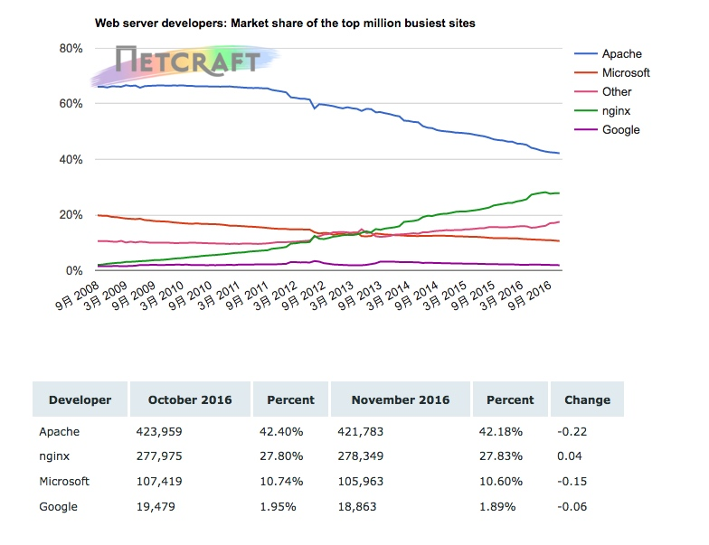

# Nginx服务器简介
## 1 了解web服务器
### 1.1	什么是web服务器
> Web 服务器是指驻留于因特网上某种类型计算机的程序。当 Web 浏览器（客户端）连到服务器上并请求文件时，服务器将处理该请求并将文件发送到该浏览器上，附带的信息会告诉浏览器如何查看该文件（即文件类型）。服务器使用HTTP（超文本传输协议）进行信息交流，这就是人们常把它们称为 HTTPD 服务器的原因。
### 1.2	目前比较主流的web服务器

+ **Apache**
> Apache  仍然是世界上用得最多的 Web  服务器，市场占有率达 60%左右。它源于 NCSAhttpd  服务器，在 NCSA WWW  服务器项目停止后，那些使用 NCSA www  服务器的人们开始交换用于此服务器的补丁，这也是 Apache  名称的由来 （ pache 补丁 ) 。世界上很多著名的网站都是 Apache的用户，它的优势主要在于源代码开放、有一支开放的开发队伍、支持跨平台的应用 ( 可以运行 在几乎所有的 Unix  、Windows  、 Linux  系统平台上 )  ，以及其可移植性等。 Apache  的模块支持非常丰富，虽在速度、性能上不及其他轻量级 Web  服务器，他是属于重量级产品，所消耗的内存 也比其他 Web 服务器要高。

+	**Lighttpd**
> Lighttpd 是由一个德国人写的开源软件，其目标是提供一个专门针对高性能网站，安全、快速、兼容性好并且灵活的 Web Server 环境。它具有内存开销低、 CPU 占用率低、效能好，以及模块丰富等特点

+	**Tomcat**
> Tomcat  是一个开放源代码、运行 servlet  和 JSPWeb  应用软件的基于Java  的 Web  应用软件容 器。 Tomcat Server  是根据 servlet  和 JSP  规范执行的，因此也可以说 Tomcat Server  实行了 Apache-J akarta  规范，且比绝大多数商业应用软件服务器要好。但是， Tomcat  对静态文件、高并发的处理比较弱。

+	**IBM websphere**
> WebSphere Application Server 是一种完善、开放的 Web 应用程序服务器，是 IBM 电子商务的核心部分，它可以支持多种通用平台，因为它遵循最普及的开放标准： HTTP 、 HTML 、 JSP 、 JNDI 和 HOP 。

+	**IIS**
> iis 是 Internet Information Services 的缩写，意为互联网信息服务，是由微软公司提供的基于运行 Microsoft Windows 的互联网基本服务。IS 是一种 Web （网页）服务组件，其中包括 Web 服务器、 FTP 服务器、 NNTP 服务器和 SMTP 服务器，分别用于网页浏览、文件传输、新闻服务和邮件发送等方面，它使得在网络（包括互联网和局域网）上发布信息成了一件很容易的事。

### 1.3	当前主流web服务器市场情况
根据2016年11月的web服务器调查（在2016次调查中，收到了来自1436724046个网站和6225374个面向Web的计算机的响应）

